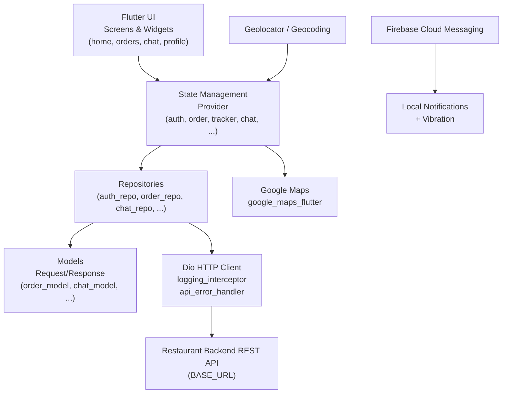

<p align="center">
  
</p>

<p align="center">
  
  
  
  
</p>

> **Developed by [Arslan Malik](https://github.com/arsalanmaalik461)**
> 📱 WhatsApp: [+92 300 8987448](https://wa.me/923008987448) · 🌐 Website: [arslanmalik.tech](https://arslanmalik.tech)

---

## 🌟 Executive Overview

**Yankee - Driver** is a Flutter-based companion app for restaurant delivery drivers, built as the driver-side half of an online food-ordering platform. It talks to the restaurant's REST backend over a Dio HTTP client, so drivers can log in, receive order assignments, accept deliveries with a slide-to-confirm gesture, navigate to customers with live GPS tracking on Google Maps, and stay in touch through in-app chat — all from one mobile app on Android and iOS.

The app is built around a clean layered architecture — screens and widgets on top, `provider`-based state management in the middle, repositories and response models at the data layer — with push notifications delivered through Firebase Cloud Messaging plus local notifications (with vibration) so drivers never miss a new order. Extras like multi-language support, dark/light themes, onboarding, a delivery timer, and order history round it out into a complete driver workflow from assignment to doorstep.

---

## 📑 Table of Contents

- [✨ Key Features & Highlights](#-key-features--highlights)
- [🖥️ Feature Showcase](#️-feature-showcase)
- [🏗️ System Architecture](#️-system-architecture)
- [🚀 Quickstart & Installation Guide](#-quickstart--installation-guide)
- [📂 Project Structure](#-project-structure)
- [🛡️ Security & Notes](#️-security--notes)

---

## ✨ Key Features & Highlights

| Feature | Description |
| :--- | :--- |
| 🔐 Driver Authentication | Login / logout against the backend API, with the session token persisted locally via `shared_preferences`. |
| 📦 Order Dashboard | Home screen lists live assigned orders with shimmer loading states and order widgets. |
| ✅ Slide-to-Accept | Accept deliveries with a slide-button gesture plus a delivery confirmation dialog. |
| 🧾 Order Details | Full breakdown of each order — items, amounts, customer info — before and during delivery. |
| 🗺️ Live Delivery Tracking | Real-time driver position and route tracking with `google_maps_flutter`, `geolocator`, and `geocoding`. |
| ⏱️ Delivery Timer | On-screen timer view to track delivery progress per order. |
| 🕘 Order History | Past deliveries ledger for the driver's records. |
| 💬 In-App Chat | Message customers during a delivery — text plus photo attachments via the image picker. |
| 🔔 Push Notifications | Order alerts through Firebase Cloud Messaging, surfaced as local notifications with vibration. |
| 🌍 Multi-Language | Language chooser screen with localized strings (`flutter_localizations` + language assets). |
| 🌗 Dark & Light Themes | Two full themes with the Rubik font family across regular, medium, and bold weights. |
| 👤 Driver Profile | Profile screen with sign-out flow and confirmation dialog. |
| 👋 Onboarding & Splash | Onboarding flow and a splash screen that syncs remote config on launch. |
| 📄 HTML Viewer | Renders terms, privacy, and other policy pages from the backend. |

---

## 🖥️ Feature Showcase

### 1. Order Lifecycle — Accept → Deliver

> The core driver loop: get assigned, accept, navigate, deliver.

- New orders arrive via push notification and appear on the home dashboard
- Driver accepts with a **slide-to-confirm button** and a delivery dialog
- Delivery timer tracks the trip; order history records it afterwards
- Slide and permission dialogs guard the delivery confirmation step

### 2. Live GPS Tracking

> The customer and the backend always know where the driver is.

- Real-time position from `geolocator`, rendered on `google_maps_flutter`
- `geocoding` converts coordinates to readable addresses
- `TrackBody` payloads report tracking updates back to the REST API

### 3. In-App Chat

> Drivers and customers message each other without leaving the delivery flow.

- Chat screen with message bubbles and shimmer loading placeholders
- Photo attachments via `image_picker`, with an image preview dialog
- Backed by the chat repository against the backend API

### 4. Notifications, Languages & Themes

> Built for real-world, multi-region delivery fleets.

- Firebase Cloud Messaging for order alerts, `flutter_local_notifications` for on-device display, plus `vibration`
- Choose-language screen with a searchable language list and localized assets
- Dark and light themes using the bundled Rubik font family

---

## 🏗️ System Architecture



---

## 🚀 Quickstart & Installation Guide

### Prerequisites

- Flutter SDK (Dart ≥ 2.7 per `pubspec.yaml`)
- Android Studio / Xcode with an emulator or a physical device
- A Google Maps API key (for the maps screens)
- A Firebase project (for push notifications), with `google-services.json` / `GoogleService-Info.plist`

### Step-by-Step Installation

```bash
# 1. Clone the repo
git clone https://github.com/arsalanmaalik461/Yankee-Restaurant-Driver.git
cd Yankee-Restaurant-Driver

# 2. Fetch dependencies
flutter pub get

# 3. Point the app at your backend (if different from the default)
#    Edit lib/utill/app_constants.dart → BASE_URL

# 4. Configure Google Maps + Firebase keys per the Flutter docs
#    (AndroidManifest.xml / google-services.json, and the iOS equivalents)

# 5. Run on a connected device or emulator
flutter run
```

---

## 📂 Project Structure

```
Yankee-Restaurant-Driver/
├── android/                  # Android native shell (applicationId: com.aas.yankedriver)
├── ios/                      # iOS native shell
├── assets/                   # App assets
│   ├── icon/                 # Launcher & UI icons
│   ├── image/                # Images
│   ├── language/             # Localization language files
│   └── fonts/                # Rubik font family
├── lib/
│   ├── data/
│   │   ├── datasource/remote/dio/   # Dio client + logging interceptor
│   │   ├── model/                   # Request bodies & API response models
│   │   └── repository/              # auth, order, chat, tracker, profile repos
│   ├── di_container.dart             # get_it service locator
│   ├── helper/                      # API checker, date/price converters, notifications
│   ├── localization/                # App localization + language constants
│   ├── notification/                # Notification handling
│   ├── provider/                    # State: auth, order, tracker, chat, theme, ...
│   ├── theme/                       # Dark & light themes
│   ├── utill/                       # App constants (BASE_URL, APP_NAME), colors, styles
│   └── view/
│       ├── base/                    # App bar, buttons, text fields, snackbars
│       └── screens/                 # auth, dashboard, home, orders, chat, profile,
│                                    # splash, language, html viewer
├── test/                     # Widget tests
├── pubspec.yaml              # Dependencies & assets manifest
└── README.md
```

---

## 🛡️ Security & Notes

- The backend `BASE_URL` is hard-coded in `lib/utill/app_constants.dart` — point it at your own server before distributing.
- Driver auth tokens are stored with `shared_preferences` (plain storage); treat logged-in devices accordingly.
- Google Maps and Firebase keys are **not** shipped in this repo — add your own API keys and `google-services.json` / `GoogleService-Info.plist` before building.
- Keep the Firebase server key server-side; the app only needs the client config.
- Chat images are picked from the device gallery — the app requests gallery permission at runtime.

---

<p align="center">
  <sub>Developed with ❤️ by <a href="https://github.com/arsalanmaalik461">Arslan Malik</a> · 📱 <a href="https://wa.me/923008987448">WhatsApp: +92 300 8987448</a> · 🌐 <a href="https://arslanmalik.tech">arslanmalik.tech</a></sub>
</p>
